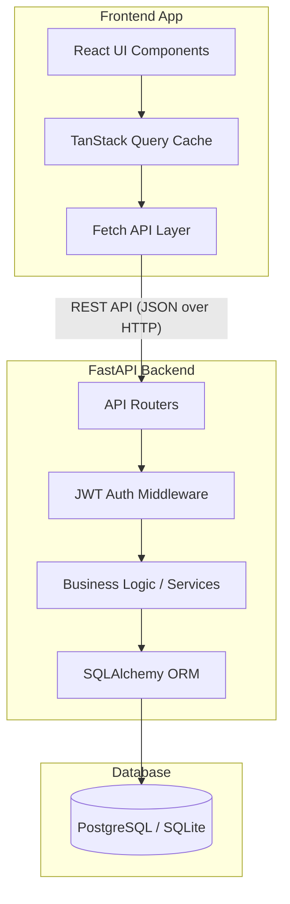
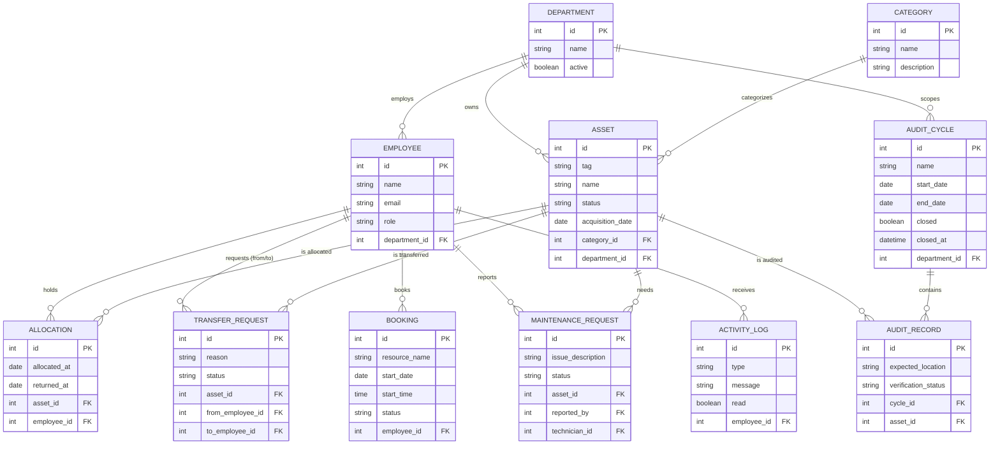

# AssetFlow

**AssetFlow** is an Enterprise Asset & Resource Management System. It replaces spreadsheets and paper logs with a single system of record for tracking who holds what, where it is, its condition, shared-resource bookings, maintenance pipelines, and audit cycles.

## 🚀 Deployed Link
*Add your deployed URL here*
- **Frontend:** `https://odoo-hackathon-mu-eight.vercel.app/`
- **Backend API:** `https://odoo-hackathon-83vq.onrender.com/`

---

## 🏗 In-Detail Architecture

AssetFlow follows a modern, decoupled client-server architecture:

### Frontend
- **Framework:** React 19 + TypeScript + Vite
- **State Management & Data Fetching:** TanStack Query (React Query)
- **Routing:** React Router DOM (v6)
- **Styling:** Pure CSS custom properties (variables) + CSS Modules for a lightweight, dependency-free, and sleek "Apple-like" UI.
- **Components:** Custom-built robust design system (Cards, Badges, Modals, Buttons) to avoid heavy UI library bloat.

### Backend
- **Framework:** FastAPI (Python 3.11+)
- **Database ORM:** SQLAlchemy 2.0
- **Database:** SQLite (dev) / PostgreSQL (production-ready)
- **Migrations:** Alembic
- **Authentication:** JWT (JSON Web Tokens) with hashed passwords
- **Validation:** Pydantic models for strict type-checking of all requests and responses

### System Architecture Diagram

---

## 📊 In-Detail Data Diagram

AssetFlow's relational database schema is designed for complete lifecycle tracking, from initial registration to allocation, maintenance, auditing, and eventual retirement.

---

## ✨ Features & Phases

AssetFlow was built iteratively across 7 major phases to ensure isolated, testable vertical slices.

### Phase 1: Identity & Org Setup
- Secure JWT-based authentication.
- Admin dashboard to manage Departments, Categories, and the Employee directory.
- Role-based access control (Admin, Asset Manager, Technician, Employee).

### Phase 2: Asset Registry
- Comprehensive asset directory with advanced filtering (by Category, Status, Department).
- Tracking of core asset metadata (Tags, Serial Numbers, Purchase Dates).

### Phase 3: Allocation & Transfer
- System of record for assigning assets to specific employees.
- Conflict detection: Prevents double-allocation natively.
- Peer-to-peer Transfer Request workflows for exchanging assets directly.

### Phase 4: Resource Booking
- Reservation system for communal resources (e.g., Conference Rooms, Projectors).
- Visual timeline collision detection (prevents overlapping bookings).

### Phase 5: Maintenance Workflow
- Drag-and-drop Kanban board for the IT/Facilities teams.
- Tracks tickets through `Pending` → `Approved` → `In Progress` → `Resolved`.
- Automatically locks associated assets to `Under Maintenance` status when approved.

### Phase 6: Audit Cycles
- Automated bulk auditing campaigns for specific departments.
- 3-state verification (Verified, Missing, Damaged).
- Closing an audit cycle automatically marks missing assets as `Lost` and spawns Maintenance tickets for `Damaged` assets.

### Phase 7: Reports & Analytics
- Live 3x2 interactive dashboard.
- Features: Inventory Status, Department Utilization, Maintenance Pipeline funnels, and Audit Match Rate gauges.
- Unified "Activity & Notifications" feed that aggregates system events into an actionable inbox.

---

## 🤝 Team Work Split

To ensure a smooth hackathon build without merge conflicts, the workload was split into two isolated **vertical slices** (each owner built the DB models, API endpoints, and React UI for their assigned screens):

| | **Dev**  *(Core Registry & Identity)* | **Ishan**  *(Operational Workflows & Insight)* |
|---|---|---|
| **Core Screens** | Login, Org Setup, Assets Directory, Allocation & Transfer | Landing Page, Resource Booking, Maintenance Kanban, Audit Cycles |
| **Phase 7 Split** | Dashboard | Reports Dashboard + Notifications/Activity Feed |
| **Why this split?** | Owns the core entities (Employees, Departments, Assets) that everything else depends on. | Owns the workflows that consume the registry, plus complex frontend features like Kanban Drag-and-Drop and Charts. |
